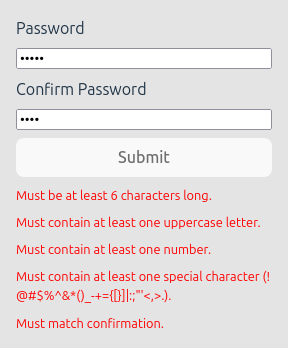

# AWeber Frontend Assessment

This repo was created using `npm create vite@latest`.

It is using React 19 and Typescript 5.8.

## Task:

Using React, write a password entry library that meets the following requirements:

- Has two input fields to validate the entry from the user (both inputs must match)
- Password has a min length of 6 characters
- Password has at least 1 uppercase character
- Password has at least 1 lowercase character
- Password has at least 1 number
- Password has at least 1 special character (!@#$%^&\*()\_-+={[}]|:;"'<,>.)
- Has a submit button that will trigger validation and present success or why the password entry failed

## Screenshots

